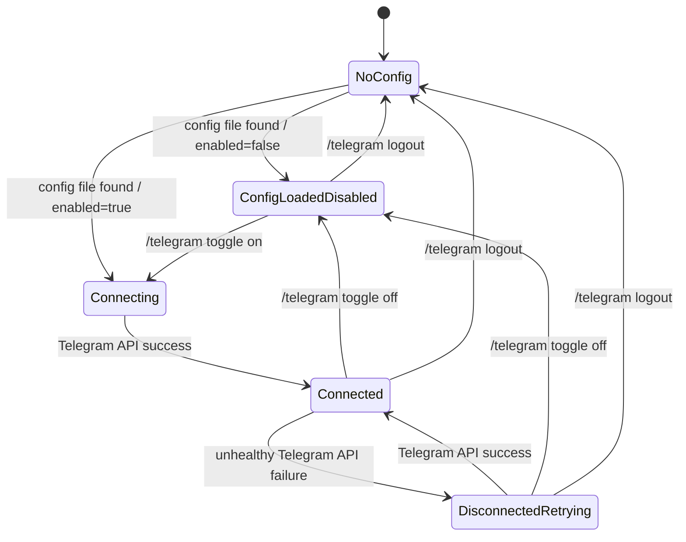
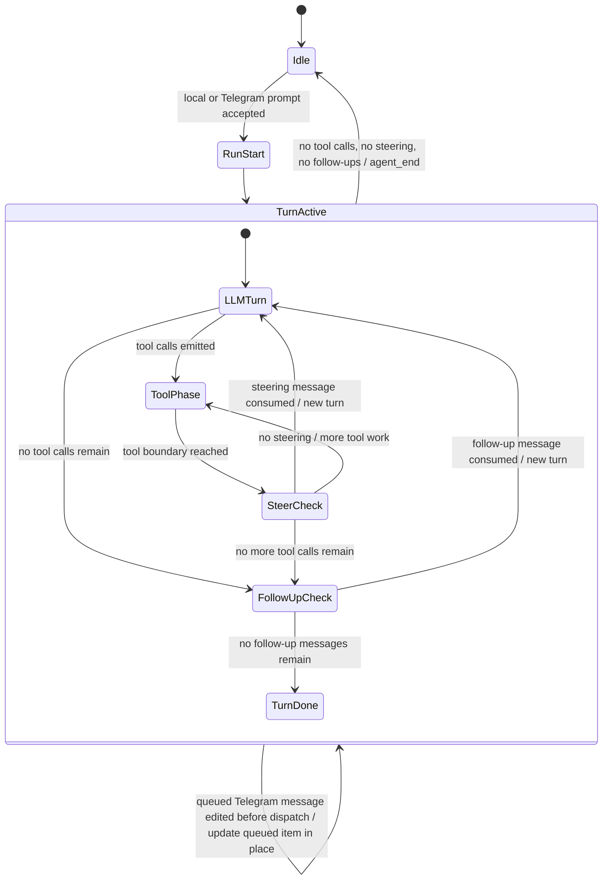

# State Transitions

This document defines the relay as a **TLA+-style state machine**.

It is not implementation code.
It is the deterministic model the implementation must preserve.

---

## Purpose

This model exists to remove ambiguity in four places:

- relay connection state
- run lifecycle state
- inbound Telegram prompt state
- queue and message-edit state

The extension implementation should be understandable as a realization of this state machine.

---

## State variables

Use these mental-model state variables.

### Relay config state

- `ConfigPresent` — whether `~/.pi/agent/pi-telegram.json` exists
- `Enabled` — persisted desired relay state from config
- `ChatId` — configured Telegram chat id
- `AllowedUserIds` — configured whitelist of accepted sender ids
- `BotId` — configured bot id
- `BotUsername` — configured bot username

### Relay runtime state

- `ConnectionState ∈ {Connected, Disconnected}`
- `LastApiSuccessAt` — timestamp of last successful Telegram API call
- `RetryIntervalSeconds = 5`
- `RetryEpisodeLogPath` — current failure log path or none
- `RetryActive` — whether runtime retry is in progress

### Agent run state

- `RunState ∈ {Idle, Active}`
- `RunId` — current active run id or none
- `TurnIndex` — current turn number inside the active run
- `AssistantPhase ∈ {Waiting, LLM, ToolPreflight, ToolExecution, TurnBoundary, Ending}`
- `ProgressMessageId` — Telegram message id for the active run or none

### Prompt state

- `AcceptanceSeq` — monotonically increasing sequence for all accepted prompt inputs
- `QueuedInputs` — FIFO list of accepted but not yet dispatched prompt items
- `QueuedTelegramIndex` — map from Telegram `message_id` to queued item identity while still queued

### Telegram input item state

Each queued Telegram prompt item conceptually has:

- `seq`
- `source = telegram`
- `telegram_message_id`
- `sender_id`
- `text`
- `dispatched ∈ {true,false}`

Local terminal items follow the same effective ordering model but do not have Telegram identity fields.

---

## Core invariants

These must always hold.

### Invariant 1 — Single config source

The relay reads and writes only:

- `~/.pi/agent/pi-telegram.json`

### Invariant 2 — Footer meaning

`TG connected` iff all are true:

- `ConfigPresent = true`
- `Enabled = true`
- runtime connect / polling loop is active
- a Telegram API call succeeded within the last 60 seconds

Otherwise the footer is `TG disconnected`.

### Invariant 3 — One run envelope

A run starts at `agent_start` and ends at `agent_end`.

Steering and follow-up messages do **not** create a new run envelope.
They extend the current run.

### Invariant 4 — One progress message per run

If `RunState = Active`, there is at most one active Telegram progress message for that run.

### Invariant 5 — Final result edits the original progress message

The final result for a run must update the original progress message.
If continuation chunks are required, the original message becomes chunk 1.

### Invariant 6 — FIFO across all sources

All accepted prompt inputs share one effective ordering relation.
Dispatch order must match acceptance order.

### Invariant 7 — Busy Telegram input defaults to follow-up

If a Telegram message is accepted while `RunState = Active`, it enters the follow-up path by default.
It is not turned into a fresh `agent.prompt()` after `agent_end`.

### Invariant 8 — Queued Telegram message edits are in-place updates

If a queued Telegram prompt has not yet been dispatched, an edit of the same Telegram `message_id` updates that queued item in place.
It does not change position.
It does not create a duplicate item.

### Invariant 9 — Whitelist enforcement

A Telegram message can affect pi only if:

- `chat_id = ChatId`
- `sender_id ∈ AllowedUserIds`

### Invariant 10 — V1 prompt-input type restriction

Only normal Telegram text messages and edits of queued normal Telegram text messages may affect prompt flow in v1.
Captions do not affect prompt flow.

### Invariant 11 — Queue persistence

Queued prompts survive disconnect / reconnect in the same process.
Queued prompts do not survive pi restart or extension reload.

### Invariant 12 — Logout does not remove already-accepted prompts

If a prompt was already accepted into pi’s prompt flow, later relay logout does not remove it from that prompt flow.

---

## Transition rules

## Relay transitions

### `LoadConfig`

Preconditions:

- pi starts or extension loads

Effects:

- load relay config from `~/.pi/agent/pi-telegram.json` if present
- set config fields
- if `Enabled = true`, begin connection attempts

### `ConnectSuccess`

Preconditions:

- a Telegram API call succeeds

Effects:

- set `LastApiSuccessAt = now`
- set `ConnectionState = Connected`
- set `RetryActive = false`
- keep current in-memory queue unchanged

### `ApiFailure`

Preconditions:

- a Telegram API call fails in a way that makes the relay unhealthy

Effects:

- set `ConnectionState = Disconnected`
- set `RetryActive = true`
- create or append to the current retry episode log
- schedule next retry after 5 seconds

### `RetryTick`

Preconditions:

- `RetryActive = true`
- 5 seconds elapsed since last retry attempt

Effects:

- attempt next Telegram API call
- on success, transition via `ConnectSuccess`
- on failure, stay disconnected and append another failure log entry

### `ToggleOff`

Preconditions:

- `/telegram toggle` or equivalent command flips `Enabled` to false

Effects:

- persist `Enabled = false`
- stop connection attempts
- set `ConnectionState = Disconnected`
- keep in-memory prompt queue unchanged for this process

### `ToggleOn`

Preconditions:

- `/telegram toggle` or equivalent command flips `Enabled` to true

Effects:

- persist `Enabled = true`
- start or resume connection attempts immediately

### `Logout`

Preconditions:

- `/telegram logout` confirmed

Effects:

- disconnect relay
- delete `~/.pi/agent/pi-telegram.json`
- clear config-derived relay state
- do not remove prompts already accepted into pi’s prompt flow
- footer becomes disconnected

---

## Run transitions

### `RunStart`

Preconditions:

- pi begins an assistant-generating agent run

Effects:

- set `RunState = Active`
- create `RunId`
- set `TurnIndex = 1`
- create one Telegram progress message if relay is connected
- store its id in `ProgressMessageId`

### `ProgressDelta`

Preconditions:

- `RunState = Active`
- rendered Telegram progress content changed

Effects:

- edit `ProgressMessageId` in place

### `TurnBoundary`

Preconditions:

- current turn reaches a boundary where steering or follow-up polling may occur

Effects:

- evaluate steering queue first where applicable
- evaluate follow-up queue only when the agent would otherwise stop

### `RunEnd`

Preconditions:

- no tool calls remain
- no steering messages remain
- no follow-up messages remain

Effects:

- edit `ProgressMessageId` into final state
- send continuation chunks only if needed for size limits
- set `RunState = Idle`
- clear `RunId`
- clear `ProgressMessageId`

---

## Telegram input transitions

## Supported source-type rule

For v1 prompt injection:

- accept normal Telegram text messages
- accept edits of queued normal Telegram text messages
- reject captions and non-text input

### `AcceptTelegramMessageIdle`

Preconditions:

- message comes from configured `ChatId`
- sender is whitelisted
- `RunState = Idle`

Effects:

- assign next `AcceptanceSeq`
- dispatch immediately as the next prompt
- if that starts a run, transition to `RunStart`

### `AcceptTelegramMessageBusy`

Preconditions:

- message comes from configured `ChatId`
- sender is whitelisted
- `RunState = Active`

Effects:

- assign next `AcceptanceSeq`
- append to `QueuedInputs`
- index by original Telegram `message_id`
- treat it as follow-up-path input by default

### `EditQueuedTelegramMessage`

Preconditions:

- a Telegram edit arrives
- original Telegram `message_id` exists in `QueuedTelegramIndex`
- queued item has not yet been dispatched

Effects:

- update queued item text in place
- preserve original `seq`
- preserve original queue position

### `SendNewTelegramMessageWhileBusy`

Preconditions:

- `RunState = Active`
- a brand-new Telegram `message_id` is accepted

Effects:

- append a new queued item with a new `AcceptanceSeq`

### `RejectTelegramMessage`

Preconditions:

- wrong chat or non-whitelisted sender or unsupported message type
- or the message is a caption-only message in v1

Effects:

- no change to pi prompt state

---

## Queue consumption semantics

## Steering path

Steering messages are consumed:

- at the start of the run
- after tool-call boundaries where pi polls steering messages

If a steering message is consumed:

- remaining tool calls in the current turn are skipped
- the steering message enters context
- a new turn begins immediately
- `RunState` stays `Active`

## Follow-up path

Follow-up messages are consumed only when:

- no more tool calls remain in the current turn, and
- no steering messages are pending

If a follow-up message exists:

- it becomes the next pending message
- the run continues with another turn
- `RunState` stays `Active`

This is the default busy-path Telegram behavior.

---

## Mermaid state diagrams

## Relay connection state

## Run and queue flow

---

## Deterministic implementation consequences

The implementation must preserve these consequences:

1. Busy-path Telegram input extends the current run through the follow-up path.
2. Busy-path Telegram input is not turned into a fresh prompt after `agent_end`.
3. New Telegram messages enqueue new FIFO items.
4. Edits of queued Telegram messages update the queued item keyed by Telegram `message_id`.
5. All pi runs relay to Telegram while connected.
6. Connection health and retry are independent from prompt queue lifetime inside the same process.

---

## Validation targets

A human or AI should be able to verify this model through:

- `/telegram status`
- footer state visibility
- queue reports with sequence numbers
- run reports with run id, turn index, and progress message id
- retry reports with log path and attempt count
